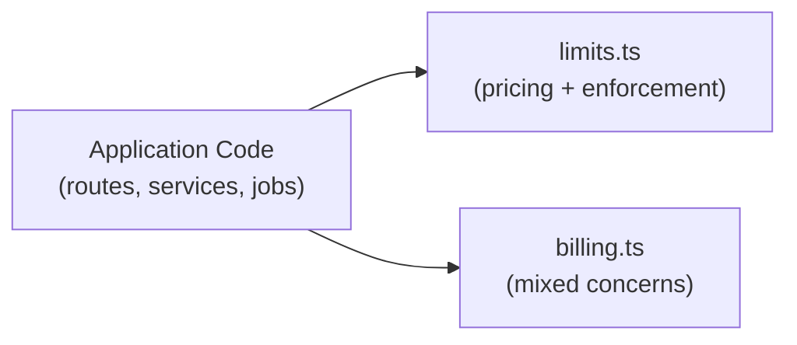
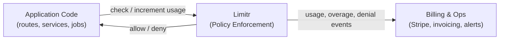

# Limitr



## Replacing `limts.ts` with Limitr

Most applications start with a file called something like `limits.ts`.

It begins small and reasonable:

* seat limits
* plan checks
* usage caps

Over time, it grows into a critical piece of infrastructure that:

* is tightly coupled to your app
* requires redeploys to change pricing
* is hard to audit or explain
* becomes brittle with usage-based or AI pricing

Limitr exists to replace this pattern.

***

## The `limits.ts` Problem

A typical `limits.ts` looks something like this:

```ts
export function canAddSeat(org) {
  if (org.plan === 'free') {
    return org.seats < 1;
  }

  if (org.plan === 'paid') {
    return org.seats < 3;
  }

  return true;
}
```

This works—until it doesn’t.

As your product evolves, this file starts accumulating:

* special cases
* overrides
* feature flags
* usage-based limits
* AI token caps
* customer exceptions

At that point:

* pricing changes require redeploys
* limits are scattered across codepaths
* behavior becomes hard to reason about
* customers can’t inspect or verify enforcement

***

## What Limitr Changes

Limitr separates **monetization policy** from **application logic**.

Instead of encoding limits in code, you describe them in a policy document and enforce them at runtime.

#### Key idea

> **Limits are data.**\
> **Enforcement is deterministic.**\
> **Consequences are application-defined.**

Your application asks Limitr:

> “Can this customer consume this right now?”

Limitr answers with:

* an allow/deny decision
* updated usage state
* emitted events when limits are hit or exceeded

#### The shift

> **Limits move from application logic to policy.**\
> The app focuses on behavior.\
> Limitr enforces truth about usage.

This is what replaces `limits.ts`.

### Before: `limits.ts` embedded in application code



**In this model:**

* Monetization logic is hard-coded into the application
* Limits, pricing rules, and exceptions live in `limits.ts`
* Changes require redeploying the app
* Logic is scattered and difficult to audit or explain
* Usage-based and AI pricing become fragile over time

### After: Limitr as the enforcement boundary



**In this model:**

* Monetization rules live in a policy document, not application code
* Limitr enforces limits locally and deterministically
* The application asks _what is allowed_, not _how to enforce_
* Billing and operations subscribe to events instead of embedding logic
* Policies can evolve independently of product code

***

## The Same Logic in Limitr

Here’s the same seat-based logic expressed as a Limitr policy:

```yaml
policy:
  credits:
    seat:
      description: A single seat credit

  plans:
    free:
      entitlements:
        seats:
          limit:
            credit: seat
            value: 1
            increment: 1
    
    paid:
      entitlements:
        seats:
          limit:
            credit: seat
            value: 3
            increment: 1
```

No conditionals.\
No branching logic.\
No redeploys to change limits.

***

### Enforcing Limits in Code

Your application code becomes simpler and more explicit:

```ts
const policy = await Limitr.new(`# policy goes here`, 'yaml'); // creates stof doc

await policy.allow(subjectId, 'tokens', 3000);
await policy.increment(subjectId, 'seats'); // shorthand allow a standard usage increment

const seats = await policy.value(subjectId, 'seats'); // current 'seats' value (meter)
```

If the limit is exceeded:

* the call returns `false`
* a `meter-limit` event is emitted
* your application decides what happens next

This might mean:

* blocking the action
* showing an upgrade prompt
* recording an overage
* notifying billing systems

Limitr does not assume billing behavior; it only enforces truth.

***

## Meters, Entitlements, and Customers

Limitr uses a small set of concepts:

* **Customers**\
  Entities being limited (users, orgs, API keys, etc.)
* **Entitlements**\
  Named capabilities attached to plans (e.g. `seats`, `tokens`)
* **Meters**\
  Stateful counters stored per customer per entitlement
* **Limits**\
  Rules that control how meters are allowed to change
* **Credits**\
  Abstract currency used to limit and meter (e.g. `credit`, `token`, `seat`, `custom`)

This makes enforcement:

* explicit
* auditable
* and easy to reason about

***

## Why This Matters for AI & Usage-Based Products

AI and usage-based pricing make `limits.ts` unmanageable.

Limits change frequently:

* model pricing shifts
* token costs vary
* plans evolve
* customers negotiate exceptions

Limitr allows you to:

* update limits without redeploying
* version and audit pricing logic
* enforce usage locally and offline
* keep monetization logic inspectable

***

## How This Fits with Billing

Limitr is not a billing system.

Instead, it acts as the **source of truth** for usage and limits.

Billing systems (Stripe, Paddle, internal tooling) can:

* subscribe to Limitr events
* read customer usage state
* calculate invoices independently

This keeps enforcement and money cleanly separated.


We use Limitr with Stripe. If you want the details for yourself, message on the Stof Discord or email me at info@stof.dev. If enough reach out, I'll create a more formal doc/project for this.


***

## Why Limitr Is Built on Stof

Limitr policies are powered by **Stof**, an open-source data + logic runtime.

Stof allows policies to:

* be expressed as data
* be evaluated deterministically
* run embedded or over the wire
* remain portable across environments

Limitr uses Stof so monetization logic can evolve independently from your application code.

***

## When to Replace `limits.ts`

Limitr is a good fit if:

* you already have a growing `limits.ts`
* pricing changes are frequent
* usage-based or AI pricing is involved
* you support self-hosted or open-source deployments
* you want limits to be inspectable and auditable

If your limits are static and unlikely to change, `limits.ts` may be fine—for now.

***

## Next Steps

* Review the Limitr [README](https://github.com/dev-formata-io/limitr) for a full example
* Try replacing one `limits.ts` check with a Limitr policy
* Join the community to share feedback and use cases

Limitr is designed to start small and grow with your product.
