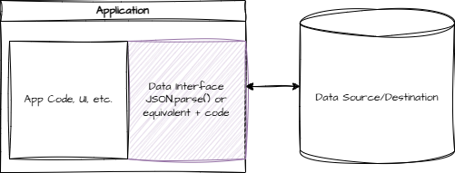
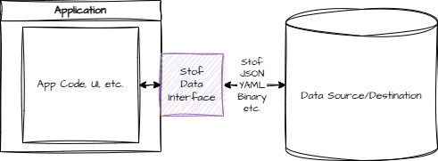
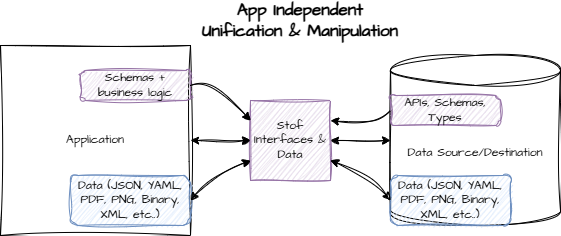

# Data Interface

A portion of an application is typically dedicated to parsing, structuring, transforming, and making data useful. This layer can be spread out between internal and/or external services, but in some shape or form, it always exists.

<figure><figcaption></figcaption></figure>

This is typically where many APIs, SDKs, parsers/importers, exporters, and headaches for developers exist. Because it often involves working with external teams, products, and services, this layer is the most fragile, messy, and painful part of an application to build. It's also usually the least documented, least scalable, and least portable portion, driving up development costs and infrastructure needs.

Stof moves this logic into the data layer so that it can be simpler to implement, standardized (by not requiring a standard), portable, more secure, and efficient.

<figure><figcaption></figcaption></figure>

Instead of writing a lot of code in each application for this layer, Stof replaces the "parse" step, turning into a small, sandboxed environment that can take on this responsibility for every application that needs access.

The "interface" consists of the additional types, functions, and data included in a Stof document, allowing host applications to utilize it more effectively.

Because interfaces are data, and Stof unifies data, portions of interfaces can come from many sources. For example, an interface could be added to a response payload, and then the application could add additional functions, schemas, and types to make it one seamless data interface.

<figure><figcaption></figcaption></figure>
