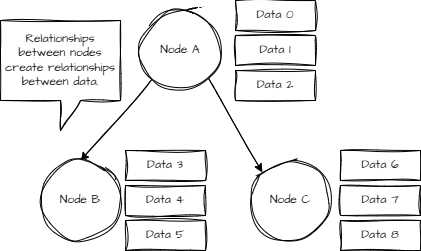
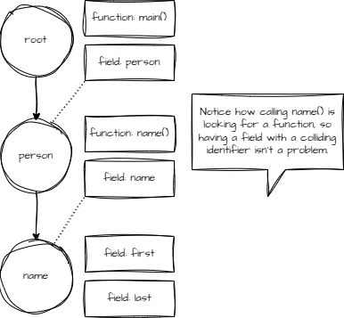
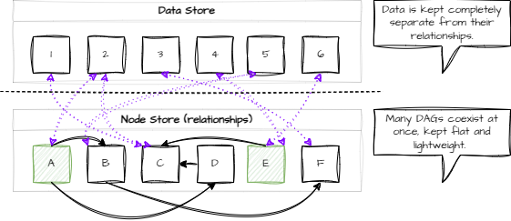
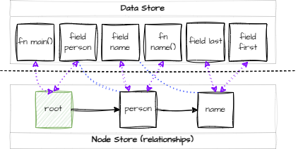

# Design

Stof is a special kind of [DAG](https://en.wikipedia.org/wiki/Directed_acyclic_graph) with an [Entity Component System](https://en.wikipedia.org/wiki/Entity_component_system) built in. Data in Stof can be thought of as components, and the nodes of the DAG are entities. Each node is a bucket of data.

Think about Stof as a fancy version of your file explorer - directories (nodes) organize different types of files (data).

## Mental Model

<figure><figcaption></figcaption></figure>

This structure is not new - it's one of the most common ways to store data. Every data format that exists is a DAG (or can be expressed as/within one), which is how Stof can be so universal.

### Concrete Example

The language around Stof is just a set of data components that know how to manipulate and describe the document that contains them. As such, we can express the following Stof document in terms of our mental model.

```rust
person: {
    name: {
        first: "Bob"
        last: "Jones"
    }
    fn get_name() -> str { return self.name.first + " " + self.name.last; }
}

#[main]
fn main() {
    pln(self.person.get_name());
}
```

<figure><figcaption></figcaption></figure>

## Actual Model

So far, we have a convenient and human-friendly way to think about Stof. For using Stof, that's all you need to get started!

However, Stof, in reality, is a bit more complicated, so it can be more efficient and model more complex relationships.

<figure><figcaption></figcaption></figure>

This strategy allows Stof to structure data in many ways simultaneously and efficiently.

Data is kept as a flat collection, completely separate from their relationships and any structure Stof introduces.

Stof's DAGs are also kept completely separate and flat, offering a lightweight and flexible way to model data. Each node can be thought of as its own DAG, but Stof also has the concept of having multiple roots. These roots can be traversed with the language and used to compartmentalize different sections of unified data entirely.


Importing and parsing data into documents offers a flexible way to dynamically determine where you'd like data to be stored in relation to the other data in the document.


### Concrete Example

```rust
person: {
    name: {
        first: "Bob"
        last: "Jones"
    }
    fn get_name() -> str { return self.name.first + " " + self.name.last; }
}

#[main]
fn main() {
    pln(self.person.get_name());
}
```

<div data-full-width="false"><figure><figcaption></figcaption></figure></div>

Although still a bit simplistic, this is generally how Stof represents data and relationships. By now, you've probably put together a lot about the language - how paths are just a dot-separated way to traverse nodes by name, or maybe how objects are just fields pointing to other nodes that contain general buckets of data (not just fields and functions).
