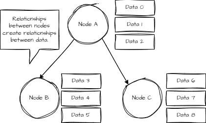
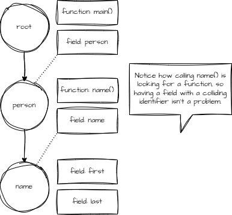
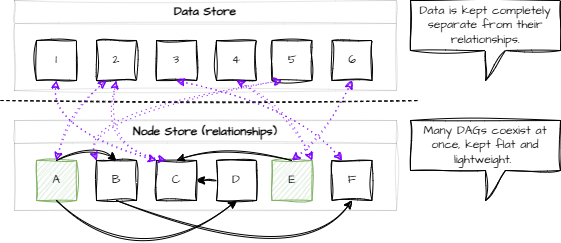
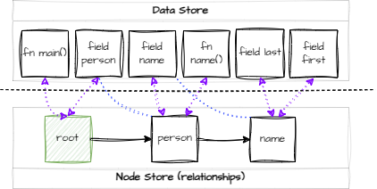

# Introduction & Design

At the heart of Stof is not a data format or language, but rather a tried and tested strategy for organizing and combining large amounts of diverse data types and relationships.

Stof is a special kind of [DAG](https://en.wikipedia.org/wiki/Directed_acyclic_graph) with an [Entity Component System](https://en.wikipedia.org/wiki/Entity_component_system) built into it. Data in Stof can be thought of as components, and the nodes of the DAG are entities. Each node is capable of housing an unknown amount of diverse data types.

If those words don't make a whole lot of sense, just think about Stof as a fancy version of your file explorer - directories (nodes) just organize different types of files (data).

The purpose of this page is to give you a mental model of Stof, which will help immensely in getting started and in understanding what Stof can do.

## Mental Model

<figure><figcaption></figcaption></figure>

This structure is not new - it's one of the most common ways to store data. Every data format that exists is a DAG (or can be expressed as/within one), which is how Stof can be so universal.

### Concrete Example

The language around Stof is just a set of data components that know how to manipulate and describe the document that contains them. As such, we can express the following Stof document in terms of our mental model.

```rust
person: {
    name: {
        first: "Bob"
        last: "Jones"
    }
    fn name(): str { return self.name.first + " " + self.name.last; }
}

#[main]
fn main() {
    pln(self.person.name());
}
```

<figure><figcaption></figcaption></figure>


I like to think about Stof in layers, each type of data component creates a layer to the overall document, and no matter who (or what) is interpreting the document, their level of understanding is determined by how many layers they know about.

For example, JSON only knows about fields, so exporting Stof to JSON loses functional capabilities. A JSON use case does not need to know about functions.

Functions and fields are just the foundational layers of Stof. Your systems can build on this and utilize additional layers of data. You can still utilize the functional interface, adding libraries and additional formats for the special layers you need to work with (or a combination of them).


## Actual Model

So far, we have a convenient and human-friendly way to think about Stof. For using Stof, that's all you need to get started!

However, Stof, in reality, is a bit more complicated, so it can be more efficient and model more complex relationships.

<figure><figcaption></figcaption></figure>

This strategy allows Stof to structure data in many ways simultaneously and more than once, without any copies while preserving the simplicity of our mental model (behaviorally).

Data is kept as a flat collection, completely separate from their relationships and any structure Stof introduces.

Stof's DAGs are also kept completely separate and flat, offering a lightweight and flexible way to model data. Each node can be thought of as its own DAG of course, but Stof also has the concept of having multiple roots. These roots can be traversed with the language and used to compartmentalize different sections of unified data entirely.


Importing and parsing data into documents offers a flexible way to dynamically determine where you'd like data to be stored in relation to the other data in the document.


### Concrete Example

For consistency, let's use the same example as before:

```rust
person: {
    name: {
        first: "Bob"
        last: "Jones"
    }
    fn name(): str { return self.name.first + " " + self.name.last; }
}

#[main]
fn main() {
    pln(self.person.name());
}
```

<div data-full-width="false"><figure><figcaption></figcaption></figure></div>

Although still a bit simplistic, this is how Stof represents data and relationships. By now, you've probably put together a lot about the language - how paths are just a dot-separated way to traverse nodes by name, or maybe how objects are just fields pointing to other nodes that contain general buckets of data (not just fields and functions).


At this point, it might be helpful to take another glance at the [objects.md](../common-concepts/objects.md "mention") page.


## Real Life

All of this is great, but why should you care? Well, if your goal is to put lots of data structures together so they can all be worked with at once (the purpose of Stof...), this is the foundation that enables it!

It doesn't matter if you're working with a PNG, PDF, CSV/Excel document, JSON (YAML, XML, etc.) files, HTML, or even a STEP (OBJ, etc.) file for graphics, all of that data can be combined using this strategy because each of these formats has a similar organization strategy (or can be contained within it), and Stofs general and portable functional interface makes it all layered and trivial to work with.

Because Stof is built in layers, systems can use portions of Stof documents, add their own data components, or enable different system interfaces through [libraries](../reference/libraries/) and additional [formats](../reference/formats.md).

In the current world of systems and architecture, where data is massive, sensitive, and tricky to move around (not to mention a total pain in the @\$$ for developers), Stof shines in being able to safely move functionality between systems while exposing a stable, efficient interface for each use case that is fun and simple to use.

## Takeaways

1. Stof is a platform to organize different types of stuff together (pun intended), not just the language itself (functions, fields, etc.).
2. Each node is a DAG that can be dynamically defined based on the data components it references and the types of components the user knows about (levels of data).
3. Data components are never copied or directly contained in the DAG, allowing them to be used in multiple relationship models simultaneously.
4. The Stof language is a general and programmatic interface to the data contained within a document (including itself). Additional libraries and formats can be added by a host environment to understand additional layers of data.
5. Stof is not limited in the types of data it can contain. Whether you're working with structured, semi-structured, or unstructured data (typed or not), Stof can handle it and form relationships around it.
6. A simple mental model for programming and working with Stof is a file system, picturing directories containing functions, fields, and any other data you need. Directories containing other directories form relationships between data. The "self" and "super" keywords just reference the current working directory or the parent directory respectfully, or, complete paths can be formed pointing to files from anywhere else in the document.
