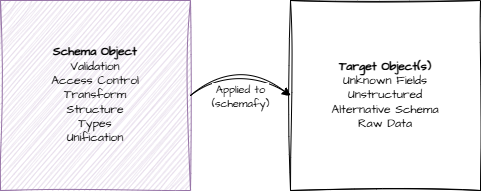

# Schemas

Every object in Stof can be considered a schema, which can be applied to other objects with the "schemafy" function (in the [Object Library](../../reference/libraries/object-library.md)). This function uses a #\[schema(...)] attribute on each field defined in the schema to manipulate and validate the corresponding fields found in the target object(s).

<figure><figcaption></figcaption></figure>


See the [Object Library](../../reference/libraries/object-library.md) for more details on how to call/use schemafy. This page is mainly for examples and a more in-depth, use-case-centric introduction to schemas.


This might be useful in a variety of situations:

* Transforming data into a different structure/schema than what was provided.
  * Alternative field names/locations
  * Subset of provided fields
  * Combination of fields
  * Filtering of data
* Validate data against additional datasets, users, or configurations.
* Protect data that gets sent to and from servers (access control/governance).

In general, if you can think it, you can probably do it (or should be able to, so [reach out if needed](../../resources-and-information.md)).

The most basic use case consists of two objects: a schema that contains the rules attached to each field we'd like to control and a target object that holds the data to which we want to apply our schema.

```rust
schema: {
    #[schema((value: str): bool => value.len() > 0)]
    name: ""

    #[schema((value: int): bool => value >= 0 && value <= 150)]
    age: 0
}

target: {
    name: "Jen"
    age: 44
}

#[main]
fn main() {
    assert(self.schema.schemafy(self.target)); // target is valid

    self.target.name = "";
    assertNot(self.schema.schemafy(self.target));
    assertNull(self.target.name); // default is to remove invalid fields...
}
```

However, one can also apply schemas to itself and/or define schemas within Stof types.


Attributes get evaluated when parsed into a Stof value, and functions defined in a Stof type will get attached to a prototype object, not the object you might be expecting. However, you can always pass the expected "schema" as an argument to functions in the attribute (see [Object Library](../../reference/libraries/object-library.md) for docs on the `#[schema(...)]` attribute).


```rust
type Schema {
    #[schema((value: str): bool => value.len() > 0)]
    name: str = ""

    #[schema((value: int): int => Number.abs(value))]
    age: int = 0
}

data: [
    {
        name: "Bo"
        age: -24
    },
    {
        name: "Ron"
        age: -73
    },
    {
        name: "Tracy"
        age: -34
    },
]

#[main]
fn main() {
    for (Schema target in self.data) target.schemafy(target);
    pln(self);
}
```

```
> stof run example.stof
{"data":[{"age":24,"name":"Bo"},{"age":73,"name":"Ron"},{"age":34,"name":"Tracy"}]}
```
